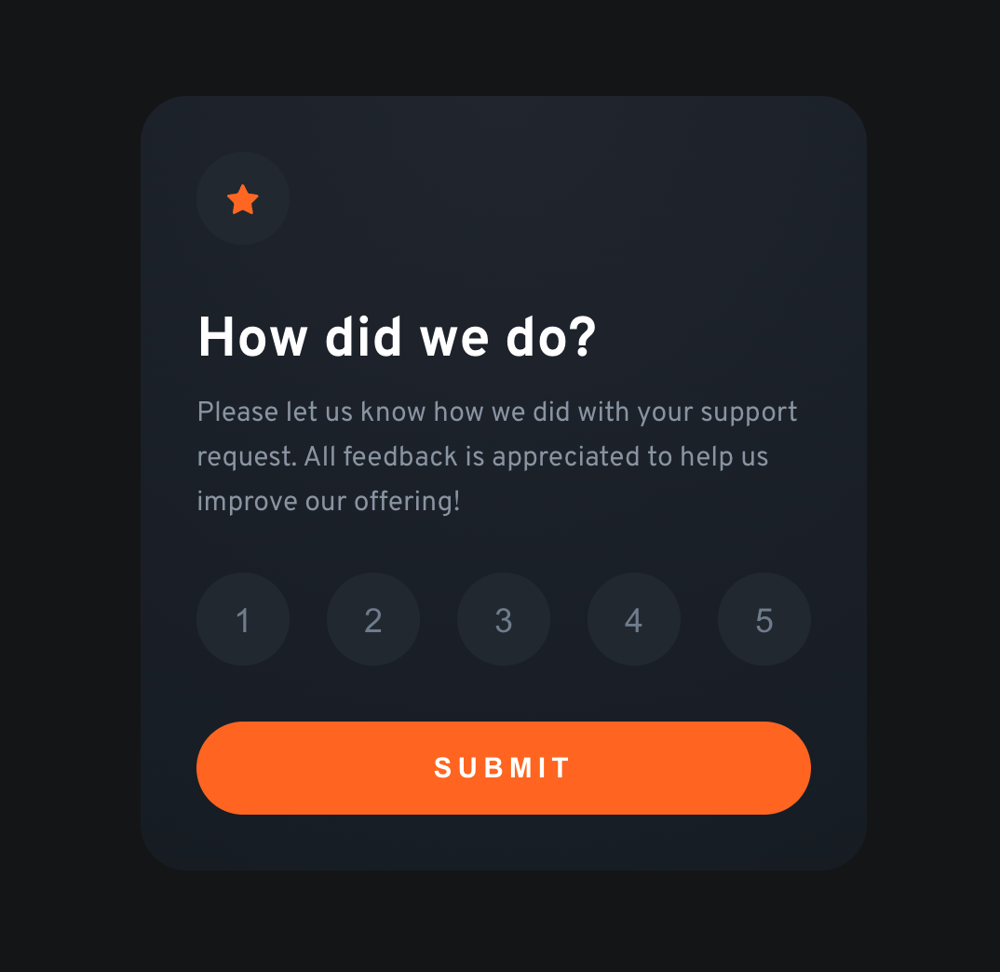

# Frontend Mentor - Interactive rating component solution

This is a solution to the [Interactive rating component challenge on Frontend Mentor](https://www.frontendmentor.io/challenges/interactive-rating-component-koxpeBUmI). Frontend Mentor challenges help you improve your coding skills by building realistic projects. 

## Table of contents

- [Overview](#overview)/.,////,
  - [The challenge](#the-challenge)
  - [Screenshot](#screenshot)
  - [Links](#links)
- [My process](#my-process)
  - [Built with](#built-with)
  - [What I learned](#what-i-learned)
- [Author](#author)

**Note: Delete this note and update the table of contents based on what sections you keep.**

## Overview

### The challenge

Users should be able to:

- View the optimal layout for the app depending on their device's screen size
- See hover states for all interactive elements on the page
- Select and submit a number rating
- See the "Thank you" card state after submitting a rating

### Screenshot

### Links

- Solution URL: [Add solution URL here](https://jkulig.github.io/interactive-rating-component)

### Built with

- Semantic HTML5 markup
- CSS custom properties
- Flexbox
- Svelte
- Vite

### What I learned

I picked up Svelte over the weekend and this is the first project after the official tutorial I worked on to utilize my knowledge. While I was utilizing only the basic concepts it helped me better understand how to structure data and send information between different componenet. By no means this is the best approach to solving the issue described in the challenge as it's definitely over-engineered but having design requirements upfront helped me focus on the FED implementation. 

## Author

- Website - [Add your name here](http://jkulig.com)
- Frontend Mentor - [@yourusername](https://www.frontendmentor.io/profile/jkulig)
